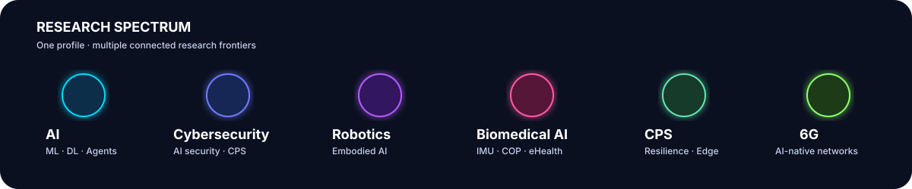
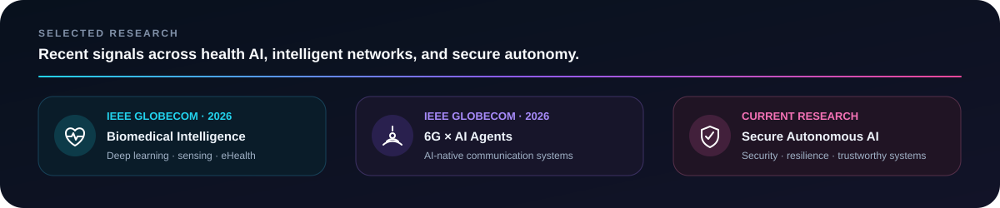

 

 

`AI · CYBERSECURITY · ROBOTICS · CPS · BIOMEDICAL INTELLIGENCE · 6G`

Researching intelligent systems where software, humans, networks, and the physical world meet.

 

 

### ✦ Research Identity

I work across **artificial intelligence, cybersecurity, embodied intelligence, cyber-physical systems, biomedical sensing, and next-generation networks**. The common thread is systems research: taking intelligent methods out of controlled settings and testing whether they remain **useful, secure, resilient, and trustworthy** in the real world.

 

 

### ✦ Research & Engineering

From scientific question → experimental system → measurement → evidence.

`AI2-THOR` · `Robotics` · `Ollama` · `Computer Vision` · `LLM/VLM Agents` · `Deep Learning` · `Runtime Security` · `CPS` · `IMU/COP Analytics` · `6G` · `Edge AI`

 

 

### ✦ Academic Footprint

<table>
<tr>
<td align="center" width="150"><h3>17+</h3>PUBLICATIONS</td>
<td align="center" width="150"><h3>10</h3>COUNTRIES COLLABORATED</td>
<td align="center" width="150"><h3>12</h3>INSTITUTIONS</td>
<td align="center" width="150"><h3>🏆</h3>BEST PAPER AWARD</td>
</tr>
</table>

Sweden · Italy · Pakistan · Spain · Portugal · Morocco · Serbia · Japan · United Kingdom · UAE

  

 

### ✦ Research Philosophy

> **Build systems that matter. Understand how they fail. Make them worthy of trust.**

My work is most interesting to me where intelligence, sensing, communication, security, and the physical world intersect — where elegant ideas must survive contact with actual systems, imperfect information, constrained resources, and real consequences.

 

 

### `RESEARCH · BUILD · TEST · UNDERSTAND · IMPROVE`

**Postdoctoral Researcher · Örebro University · Sweden**

`AI` · `SECURITY` · `ROBOTICS` · `CPS` · `BIOMEDICAL INTELLIGENCE` · `6G`

 

[**ENTER THE INTERACTIVE RESEARCH PORTFOLIO →**](https://junaid-q.github.io/)

