 

### `ARTIFICIAL INTELLIGENCE · CYBERSECURITY · INTELLIGENT SYSTEMS`

Researcher working across **AI, cybersecurity, embodied intelligence, cyber-physical systems, biomedical sensing, and next-generation networks** — building intelligent systems that are useful, secure, resilient, and grounded in real-world problems.

---

## ◈ Research Spectrum

<table>
<tr>
<td width="25%" align="center"><b>🧠 Artificial Intelligence</b> Machine learning · deep learning · intelligent agents</td>
<td width="25%" align="center"><b>🛡️ Cybersecurity</b> AI security · resilient systems · runtime protection</td>
<td width="25%" align="center"><b>🤖 Embodied Intelligence</b> Robotics · autonomous agents · physical-world AI</td>
<td width="25%" align="center"><b>📡 Future Networks</b> 6G · edge intelligence · critical infrastructure</td>
</tr>
<tr>
<td width="25%" align="center"><b>🩺 Biomedical AI</b> IMU · COP · movement and sensor analytics</td>
<td width="25%" align="center"><b>⚙️ Cyber-Physical Systems</b> Intelligence at the cyber/physical boundary</td>
<td width="25%" align="center"><b>🔬 Trustworthy AI</b> Robustness · safety · accountability</td>
<td width="25%" align="center"><b>🌐 Agentic Systems</b> LLM/VLM agents · multi-agent intelligence</td>
</tr>
</table>

## ◈ What I Work On

My research spans several connected layers of intelligent systems:

**Perception → Learning → Decision → Interaction → Security → Resilience**

I am particularly interested in systems where AI leaves the laboratory and must operate under real constraints: autonomous agents interacting with physical environments, sensor-driven biomedical intelligence, cyber-physical infrastructure, and AI-native communication systems.

## ◈ Research & Engineering Toolkit

`Machine Learning` · `Deep Learning` · `LLM/VLM Agents` · `AI2-THOR` · `Robotics` · `Ollama` · `Computer Vision` · `Sensor Analytics` · `Runtime Security` · `CPS` · `6G` · `Edge AI`

## ◈ Selected Research Areas

| Domain | Current interests |
|---|---|
| **AI & Autonomous Systems** | Intelligent agents, embodied AI, multi-agent systems, LLM/VLM-based autonomy |
| **Cybersecurity** | Security of AI-enabled systems, runtime protection, adversarial behavior, resilient CPS |
| **Biomedical Intelligence** | IMU/COP sensing, human movement analysis, deep learning for health applications |
| **Future Communication Systems** | AI agents in 6G, edge intelligence, energy-aware and resilient infrastructure |

## ◈ Publications & Research Output

My publication record spans **artificial intelligence, cybersecurity, biomedical sensing, communication systems, and intelligent infrastructure**.

**Recent 2026 research includes:**

- **IEEE GLOBECOM 2026** — biomedical deep learning and sensor-based human-state estimation
- **IEEE GLOBECOM 2026** — 6G networks empowering AI agents
- Ongoing research in **cybersecurity for embodied and autonomous AI systems**

[**EXPLORE PUBLICATIONS, PROJECTS & RESEARCH →**](https://junaid-q.github.io/)

## ◈ Research Philosophy

> **Build systems that matter. Understand how they fail. Make them worthy of trust.**

I am interested in research that connects rigorous technical ideas with real systems — particularly where intelligence, sensing, communication, security, and the physical world intersect.

---

### `RESEARCH · BUILD · TEST · UNDERSTAND · IMPROVE`

Postdoctoral Researcher · Sweden

 

**AI · SECURITY · ROBOTICS · CPS · BIOMEDICAL INTELLIGENCE · 6G**

